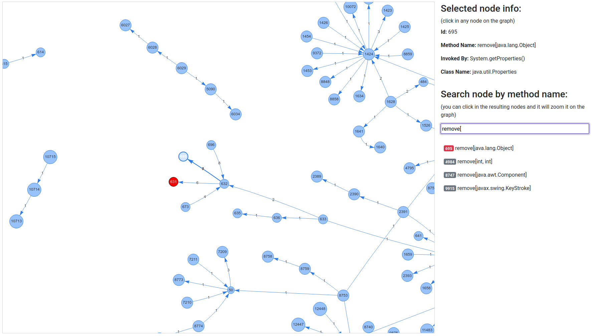

# Summary

Object-oriented languages brought important concepts and concerns to the software 
industry, such as inheritance, polymorphism, and coupling. Since the 1970s, 
these concepts have been studied, and in particular, coupling has emerged as 
an important mechanism that allows components to keep the details of their construction 
restricted [@PARNAS]. In this sense, when an object's encapsulation is compromised, its 
implementation becomes exposed, and other parts of the code can directly alter its 
behavior, reducing the cohesion of the software. This coupling between components 
can cause critical problems in the development cycle, increasing the costs of its 
evolution and maintenance. This work presents DemeterWatch, a tool to identify a 
specific case of coupling violations inside Java projects source code.

# Statement of need

One of the pillars of software engineering is the pursuit of continuous improvement of 
processes and practices, incorporating feedback and learnings throughout the software 
lifecycle. Proper documentation, efficient team collaboration, and ensuring quality are 
fundamental elements for success in this type of project. Additionally, the rapid 
evolution of technology requires software engineering professionals to stay up-to-date 
and ready to adapt to new trends and challenges in the industry, with software quality 
assurance being one of the key practices in the field [@PRESSMAN].

During the process of software development, a recurring issue is the coupling created 
between classes, often due to inefficient modeling, resulting in code with classes and
methods that are not very reusable and difficult to maintain during the other stages. 
A principle aimed at minimizing the problems mentioned above is the Law of Demeter 
(LoD) or the principle of the least knowledge [@LIEB]. When a class does not comply 
with the LoD, other problems may arise. One such issue is the confinement break, which 
occurs when an object can change the state of another object without its knowledge, by 
calling methods that improperly expose their properties.

Identifying principle violations in Java source code is challenging. Static analysis, 
the method employed in this work, cannot pinpoint which methods alter an object's state. 
Consequently, the analysis is focused on data structures within the Java Collections 
Framework (JCF). The JCF is well-documented, and its documentation specifies which 
methods modify the state of collection objects.

This approach is crucial as it highlights issues that are not readily apparent, including 
subtle and difficult-to-detect forms [@BLOCK]. It also provides a means to visualize 
detected breaches, facilitating corrections in the source code.

# Example use case

The complete dataset of experiments is available in the repository to further
visualization containing forty randomly selected projects outputs, those 
projects are present at Qualitas.class corpus [@QUALITAS]. The Table 1 
shows how many LoD violations were found in open source projects, some of them 
are well-known projects used by Java developers:

|        Name        | Violations found |
|:------------------:|:----------------:|
| Apache Collections |        6         |
|   Apache Tomcat    |        20        |
|       Quartz       |        1         |
|      JGrapht       |        6         |
|       JMeter       |        6         |
**Table 1.** Example of violations found in real open source projects analyzed by the tool.

In addition to textual output, the tool generates an HTML page with a graphical 
representation of method call chains in the source code. Nodes that violate the 
Law of Demeter (LoD) principle are highlighted in a distinct color. Each vertex's 
weight indicates the frequency of method calls. Figure 1 contains an illustrated 
example of a detected violation.

**Figure 1.** DemeterWatch HTML output page.

# Acknowledgements

The author would like to express gratitude to the IFPB Institute which made this 
research project possible to be developed and offered the support needed.

# References